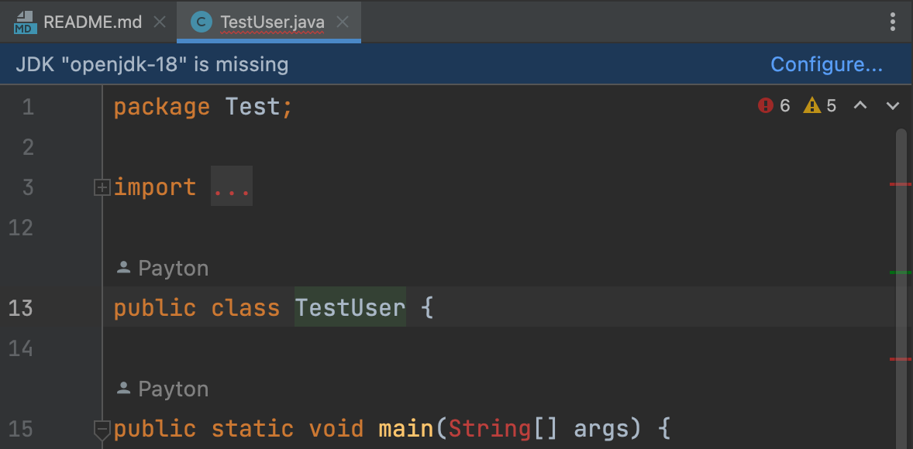
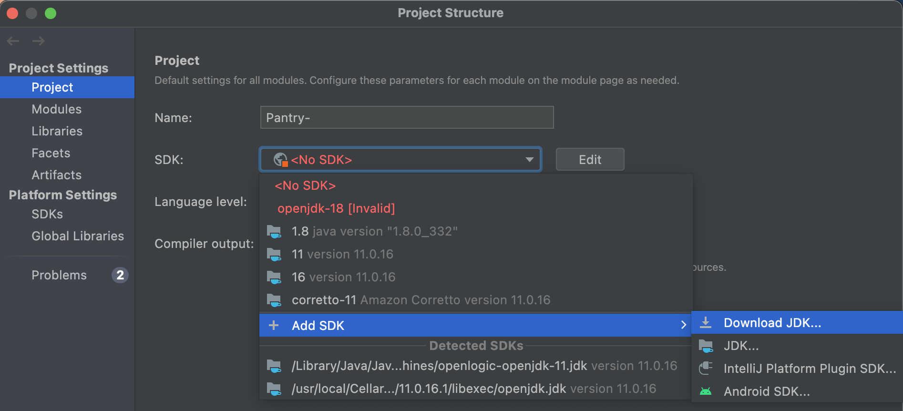
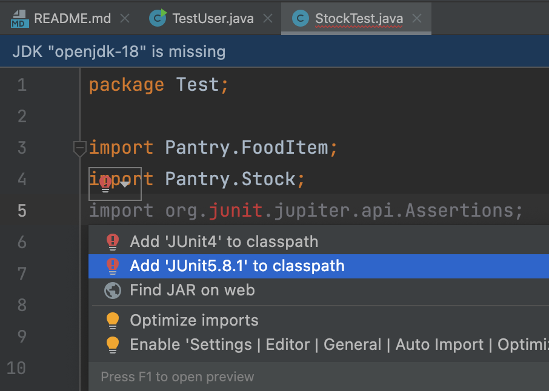
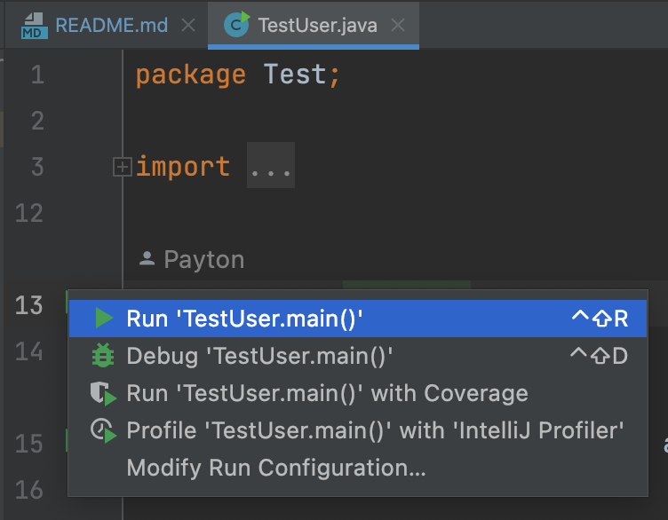

# Pantry++

Pantry++ is an application to store recipes and track food in your pantry.

## Installation
The following instructions will show you how to install and setup the application using IntelliJ.

### Clone Repository

1. Clone the main branch from this repository by running 
```bash
git clone https://github.com/Paytonjhall/Pantry-.git
```
in your preferred command line.
2. In IntelliJ, click *File > Open* and navigate to the directory where you cloned this repository.

### JDK 18

Now you need to configure JDK *openjdk-18*. You will either see a popup saying *JDK openjdk-18 is missing* or you will 
need to navigate to the *Project Structure*.

3. If you see the following popup
   
click *Configure* and select JDK 18.

4. If you don't see the popup shown in step 3, navigate to *File > Project Structure*.

5. Select the SDK dropdown and click on JDK 18.
(If you dont have JDK 18 downloaded you can select *Add SDK > Download JDK...* and select version 18.)
   

### JUnit5

6. Navigate to *Pantry- > src > Test > StockTest*.

7. If there are red *Problems* because of you are missing JUnit5, hover over the red junit and click on the red light 
bulb. 

8. Click on *Add 'JUnit5.8.1' to classpath*. (The version might be slightly different, but just make sure it starts with 
JUnit5).
   

## Usage

To run the application, navigate to *Pantry- > src > Test > TestUser* and click the play button next to the class to *Run 'TestUser.main()'*.

